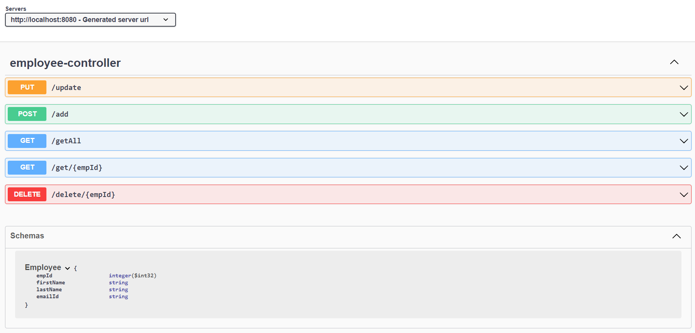

# Employee_CRUD

A simple CRUD application for making a data of employees with Angular+Spring

# Getting Started

Want to surf around the project in your local system?

Here is your way to get into it

Clone the repo by using the following command in your bash

git clone https://github.com/Akhiltop/Employee_CRUD.git

1. Import the SQL query file in your Workbench as I used Mysql for connection

2. Import the Spring Boot application into your IDE. My preference was STS

3. Run the project as the Springboot application

4. Make angular in an appropriate file and install relevant node requirements

5. Make sure you have the latest installations

6. Serve the angular project

7. Now you are ready to experiment with the things

# Prerequisites

1. Sometimes even after installing the required things you may get any errors because of the exhaustive list.

2. Make a note of this below

-Java Development Kit

-Appropriate IDE to run SpringBoot applications

-Lombok

-Node.js

-Node Package Manager

-Angular Command Line

Even if I may miss something if you feel anything is ignored make a request

# API Endpoints

- Update Employee - PUT request
- Create Employee - POST request
- List Employee - GET request
- View Employee - GET request
- Delete Employee - DELETE request

Finally, here is a video of this which may be much helpful for you in understanding every detail

<a href="https://drive.google.com/file/d/1WZ1PC0NaZL0SU3BRQBJX92bMOWyB4SGr/view?usp=sharing" target="_blank">Demonstration</a>
